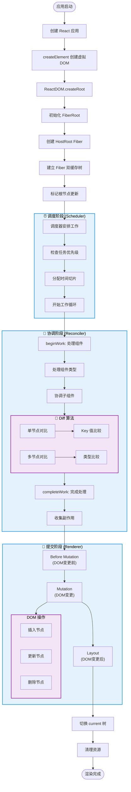

```mermaid
flowchart TB
    Start([应用启动]) --> CreateApp[创建 React 应用]
    CreateApp --> CreateElement[createElement 创建虚拟DOM]
    CreateElement --> CreateRoot[ReactDOM.createRoot]
    CreateRoot --> InitFiberRoot[初始化 FiberRoot]
    InitFiberRoot --> InitHostRoot[创建 HostRoot Fiber]
    InitHostRoot --> SetupFiber[建立 Fiber 双缓存树]
    SetupFiber --> MarkUpdate[标记根节点更新]
    MarkUpdate --> ScheduleWork[调度器安排工作]
    
    %% 调度阶段
    subgraph SchedulerPhase ["⏰ 调度阶段 (Scheduler)"]
        ScheduleWork --> CheckPriority[检查任务优先级]
        CheckPriority --> TimeSlice[分配时间切片]
        TimeSlice --> StartWork[开始工作循环]
    end
    
    %% 协调阶段
    subgraph ReconcilePhase ["🔄 协调阶段 (Reconciler)"]
        direction TB
        StartWork --> BeginWork[beginWork: 处理组件]
        BeginWork --> ProcessComponent[处理组件类型]
        ProcessComponent --> ReconcileChildren[协调子组件]
        
        %% Diff 算法细节
        ReconcileChildren --> DiffAlgorithm
        subgraph DiffAlgorithm ["🧬 Diff 算法"]
            SingleElement[单节点对比]
            MultiElement[多节点对比]
            KeyComparison[Key 值比较]
            TypeComparison[类型比较]
            
            SingleElement --> KeyComparison
            MultiElement --> TypeComparison
        end
        
        DiffAlgorithm --> CompleteWork[completeWork: 完成处理]
        CompleteWork --> CollectEffects[收集副作用]
    end
    
    %% 提交阶段
    subgraph CommitPhase ["🎨 提交阶段 (Renderer)"]
        direction TB
        CollectEffects --> BeforeMutation["Before Mutation<br/>(DOM变更前)"]
        BeforeMutation --> Mutation["Mutation<br/>(DOM变更)"]
        Mutation --> Layout["Layout<br/>(DOM变更后)"]
        
        %% 具体操作
        Mutation --> DOMOperations
        subgraph DOMOperations ["DOM 操作"]
            Insert[插入节点]
            Update[更新节点]
            Delete[删除节点]
        end
    end
    
    Layout --> SwitchTree[切换 current 树]
    SwitchTree --> CleanUp[清理资源]
    CleanUp --> Complete([渲染完成])
    
    %% 样式优化
    classDef phaseBox fill:#e3f2fd,stroke:#2196f3,stroke-width:2px,color:#000
    classDef processBox fill:#f3e5f5,stroke:#9c27b0,stroke-width:2px,color:#000
    
    class SchedulerPhase,ReconcilePhase,CommitPhase phaseBox
    class DiffAlgorithm,DOMOperations processBox

```
