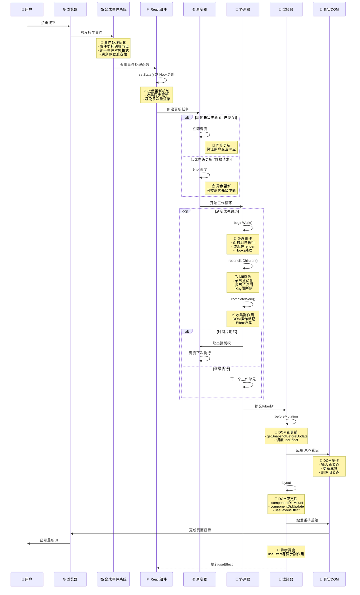

```mermaid
sequenceDiagram
    participant User as 👤 用户
    participant Browser as 🌐 浏览器
    participant SyntheticEvent as 🎭 合成事件系统
    participant Component as ⚛️ React组件
    participant Scheduler as ⏰ 调度器
    participant Reconciler as 🔄 协调器
    participant Renderer as 🎨 渲染器
    participant DOM as 📄 真实DOM

    %% 用户交互阶段
    User->>Browser: 点击按钮
    Browser->>SyntheticEvent: 触发原生事件
    
    Note over SyntheticEvent: 🔧 事件处理优化<br/>- 事件委托到根节点<br/>- 统一事件对象格式<br/>- 跨浏览器兼容性
    
    SyntheticEvent->>Component: 调用事件处理函数
    
    %% 状态更新阶段
    Component->>Component: setState() 或 Hook更新
    
    Note over Component: 💡 批量更新机制<br/>- 收集同步更新<br/>- 避免多次重渲染
    
    Component->>Scheduler: 创建更新任务
    
    %% 调度决策
    alt 高优先级更新 (用户交互)
        Scheduler->>Scheduler: 立即调度
        Note right of Scheduler: 🚀 同步更新<br/>保证用户交互响应
    else 低优先级更新 (数据请求)
        Scheduler->>Scheduler: 延迟调度
        Note right of Scheduler: ⏱️ 异步更新<br/>可被高优先级中断
    end
    
    %% 协调阶段
    Scheduler->>Reconciler: 开始工作循环
    
    loop 深度优先遍历
        Reconciler->>Reconciler: beginWork()
        Note over Reconciler: 🧬 处理组件<br/>- 函数组件执行<br/>- 类组件render<br/>- Hooks处理
        
        Reconciler->>Reconciler: reconcileChildren()
        Note over Reconciler: 🔍 Diff算法<br/>- 单节点优化<br/>- 多节点复用<br/>- Key值匹配
        
        Reconciler->>Reconciler: completeWork()
        Note over Reconciler: ✅ 收集副作用<br/>- DOM操作标记<br/>- Effect收集
        
        %% 时间切片检查
        alt 时间片用尽
            Reconciler->>Scheduler: 让出控制权
            Scheduler->>Scheduler: 调度下次执行
        else 继续执行
            Reconciler->>Reconciler: 下一个工作单元
        end
    end
    
    %% 提交阶段
    Reconciler->>Renderer: 提交Fiber树
    
    %% Before Mutation阶段
    Renderer->>Renderer: beforeMutation
    Note over Renderer: 🔄 DOM变更前<br/>- getSnapshotBeforeUpdate<br/>- 调度useEffect
    
    %% Mutation阶段
    Renderer->>DOM: 应用DOM变更
    Note over DOM: 🎨 DOM操作<br/>- 插入新节点<br/>- 更新属性<br/>- 删除旧节点
    
    %% Layout阶段
    Renderer->>Renderer: layout
    Note over Renderer: 📏 DOM变更后<br/>- componentDidMount<br/>- componentDidUpdate<br/>- useLayoutEffect
    
    %% 完成更新
    Renderer->>DOM: 触发重排重绘
    DOM->>Browser: 更新页面显示
    Browser->>User: 显示最新UI
    
    %% 异步效果
    Note over Renderer: 🔄 异步调度<br/>useEffect等异步副作用
    
    Renderer-->>Component: 执行useEffect
```
