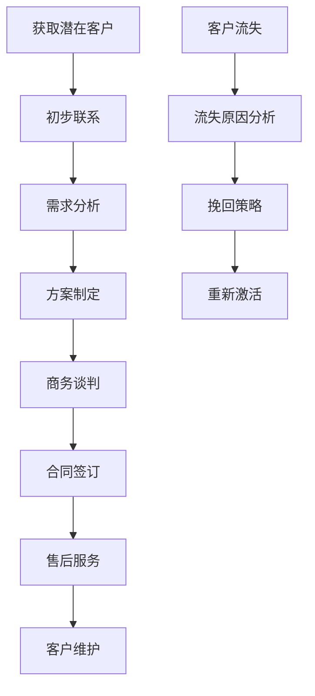
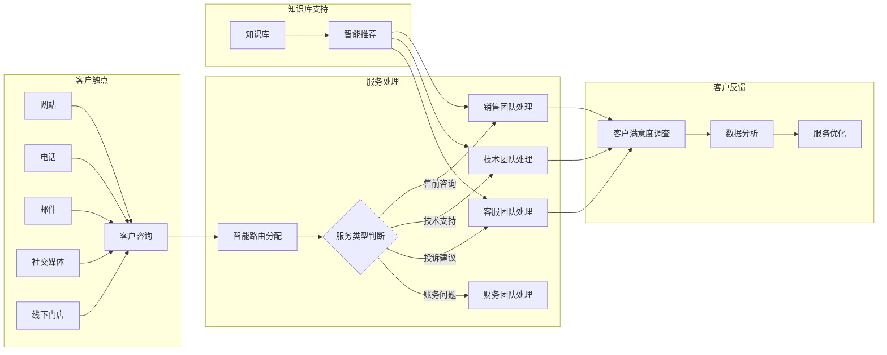
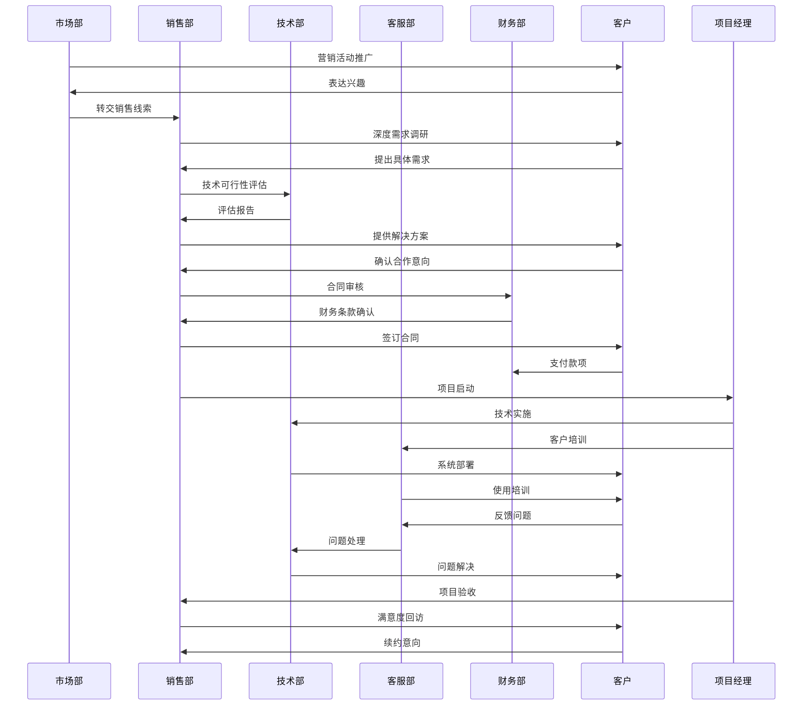
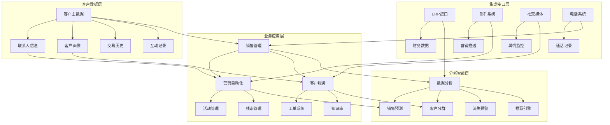

# CRM系统学习 - Step 2

## CRM系统概述

**CRM (Customer Relationship Management)** 客户关系管理系统，是一种以客户为中心的商业策略和技术平台。它帮助企业管理与客户的互动，优化客户体验，提升客户满意度和忠诚度，最终实现业务增长。

## 行为主体与客体

### 行为主体：
- 销售人员
- 客服人员
- 市场营销人员
- 客户
- 潜在客户
- 合作伙伴
- 管理层

### 行为客体：
- 客户信息
- 销售机会
- 营销活动
- 服务请求
- 客户反馈
- 商机
- 合同

## 关键数据流转

1. **客户流**：潜在客户→意向客户→成交客户→忠诚客户
2. **销售流**：线索→商机→报价→合同→回款
3. **服务流**：服务请求→工单分派→问题解决→客户反馈

## 场景示例

### 1. 简单场景：客户销售漏斗管理

### 2. 复杂场景：全渠道客户服务管理

### 3. 更复杂场景：企业级CRM生态系统

#### 时序图：多部门协同客户开发流程

#### 生态架构图：CRM系统整合架构

## CRM核心功能模块

### 1. 销售管理
- **线索管理**：潜在客户信息跟踪和转化
- **商机管理**：销售机会的阶段管理和预测
- **报价管理**：标准化报价流程和模板
- **合同管理**：合同生命周期管理

### 2. 营销自动化
- **活动管理**：营销活动的策划、执行和效果分析
- **线索评分**：基于行为的线索质量评估
- **个性化推荐**：基于客户画像的精准营销
- **多渠道营销**：整合线上线下营销渠道

### 3. 客户服务
- **工单管理**：服务请求的全流程跟踪
- **知识库**：常见问题解答和解决方案
- **客户反馈**：满意度调查和意见收集
- **服务级别协议**：响应时间和质量保证

### 4. 客户分析
- **客户画像**：360度客户视图
- **行为分析**：客户互动模式分析
- **价值分析**：客户生命周期价值评估
- **预测分析**：未来行为趋势预测

## CRM核心特点

1. **客户中心**：以客户需求为核心的业务理念
2. **全渠道**：整合所有客户触点的统一体验
3. **智能化**：AI驱动的客户洞察和自动化
4. **个性化**：基于数据分析的个性化服务
5. **协同性**：跨部门协作的客户关系管理

## 与ERP的关系

- **ERP**关注企业内部资源和流程管理
- **CRM**关注外部客户关系和销售机会
- **集成**：CRM提供销售预测给ERP的生产计划，ERP提供成本数据给CRM的报价系统

## 学习要点

- 理解CRM以客户为中心的核心理念
- 掌握客户生命周期的各个阶段管理
- 熟悉销售、营销、服务三大模块的协同
- 了解数据分析在CRM中的重要作用
- 掌握CRM与其他系统的集成方式

这些CRM基础知识将帮助您理解客户关系管理的核心概念和业务流程，为后续从事相关开发工作做好准备。
