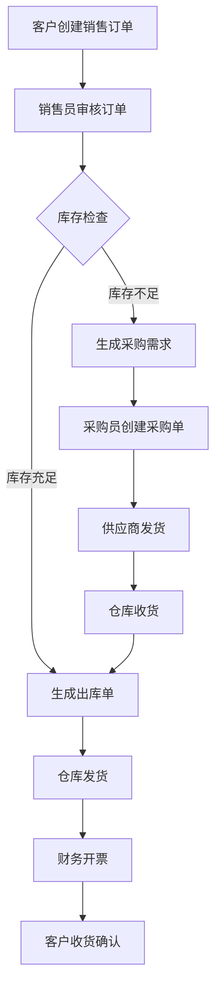
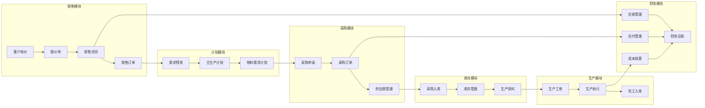
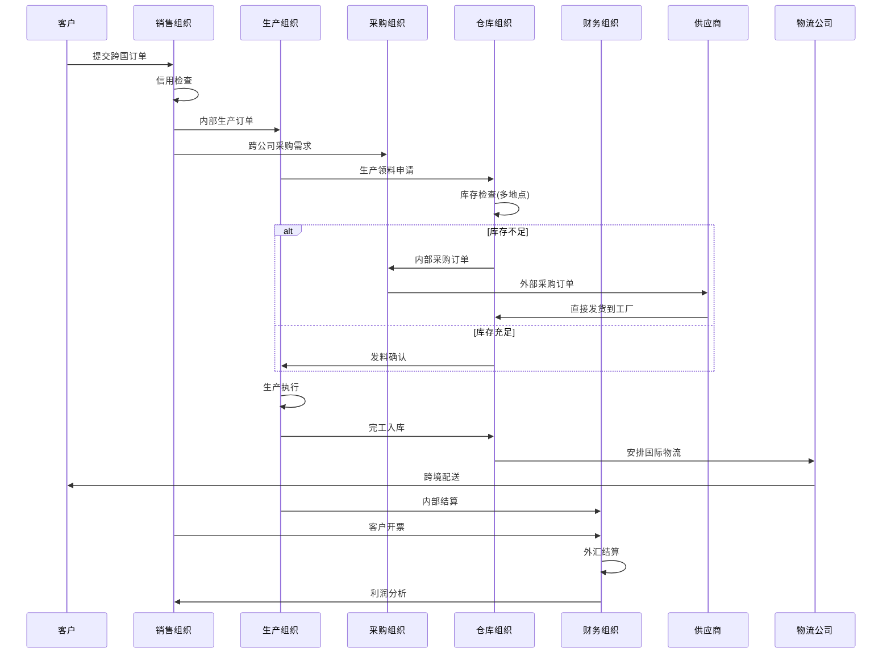
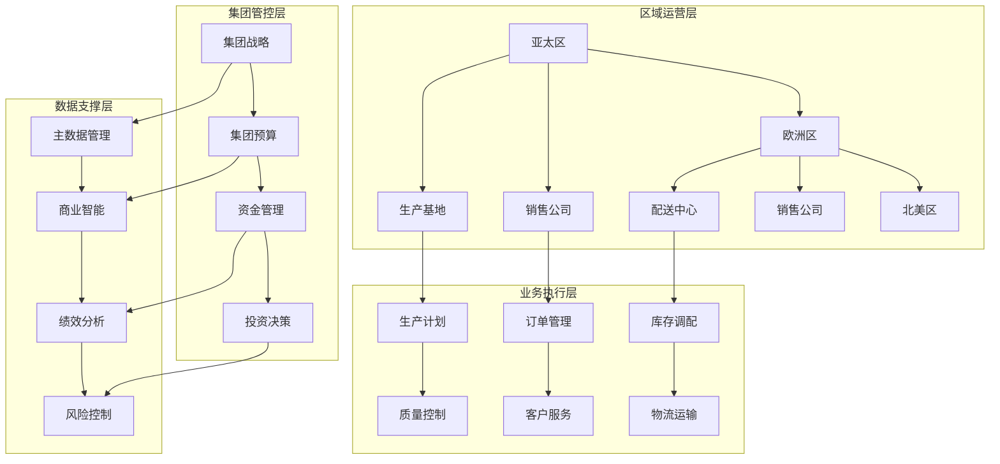

# ERP&CRM学习 - Step 1

## ERP系统概述

**ERP (Enterprise Resource Planning)** 企业资源计划系统，是一种集成了企业各个部门业务流程的管理平台。它解决了企业信息孤岛、流程不统一、数据不同步等问题，实现资源优化配置和业务协同。

## 行为主体与客体

### 行为主体：
- 员工（销售、采购、生产、财务、仓库等）
- 客户
- 供应商
- 管理层
- 系统管理员

### 行为客体：
- 物料/产品
- 订单
- 资金
- 设备
- 数据/信息

## 关键数据流转

1. **业务流**：销售订单→生产计划→采购需求→库存管理→财务核算
2. **资金流**：应收账款→现金管理→应付账款→成本核算
3. **信息流**：市场信息→需求预测→生产计划→执行反馈

## 场景示例

### 1. 简单场景：销售订单处理流程

### 2. 复杂场景：生产制造企业完整业务流程

### 3. 更复杂场景：多组织跨国集团ERP协同

#### 时序图：跨国订单处理流程

#### 层级架构图：集团管控体系

## ERP核心特点

1. **集成性**：各模块无缝集成，数据实时共享
2. **标准化**：统一业务流程和数据规范
3. **实时性**：业务数据实时更新，支持及时决策
4. **可控性**：完善的权限控制和审计追踪

## 学习要点

- 理解ERP的核心业务流程和数据流转
- 掌握不同规模企业的ERP应用场景
- 熟悉各业务模块之间的协同关系
- 了解ERP系统的技术架构和实现原理

这些基础知识将为您后续从事ERP相关场景开发工作奠定坚实基础。
