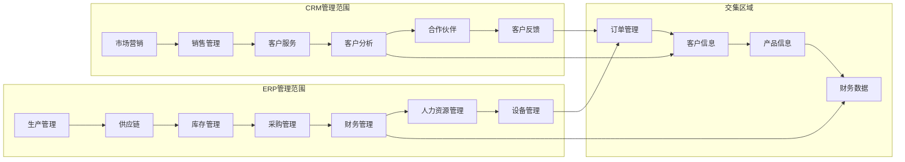
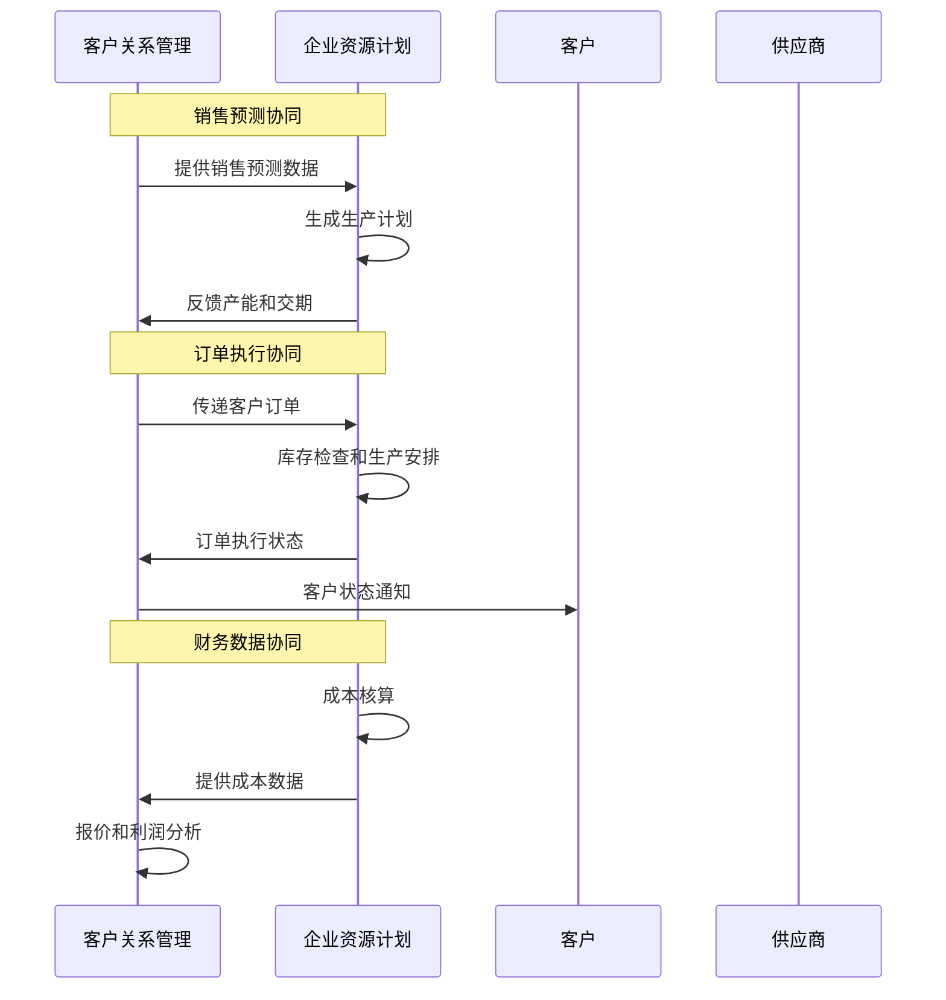
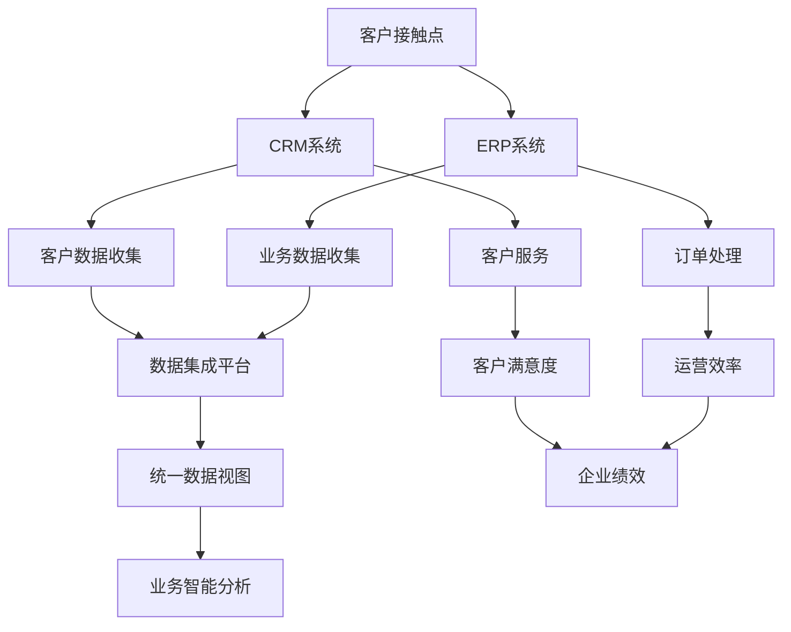
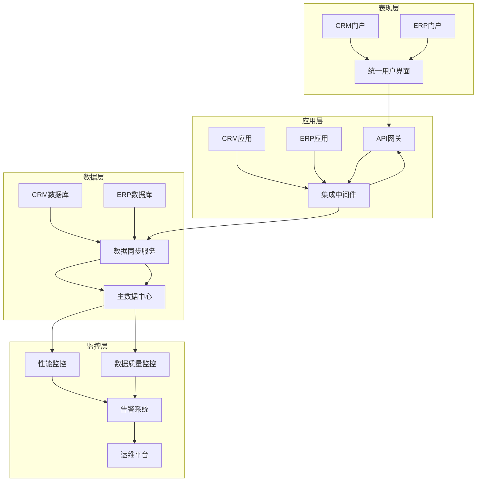
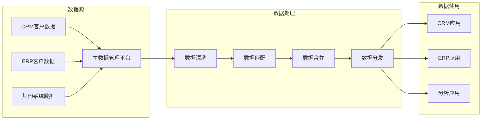
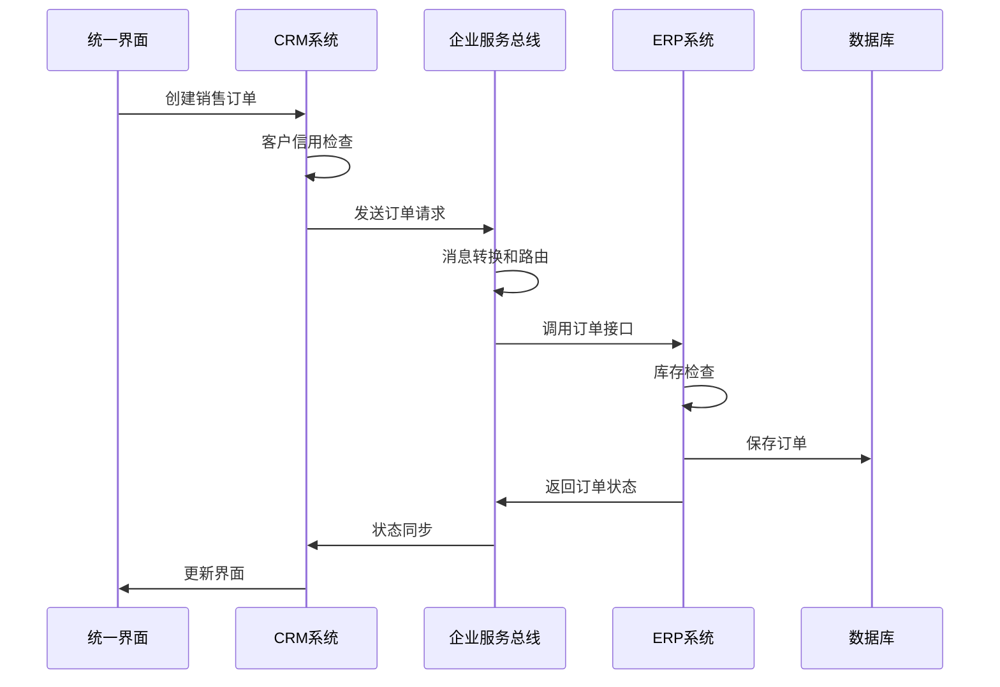
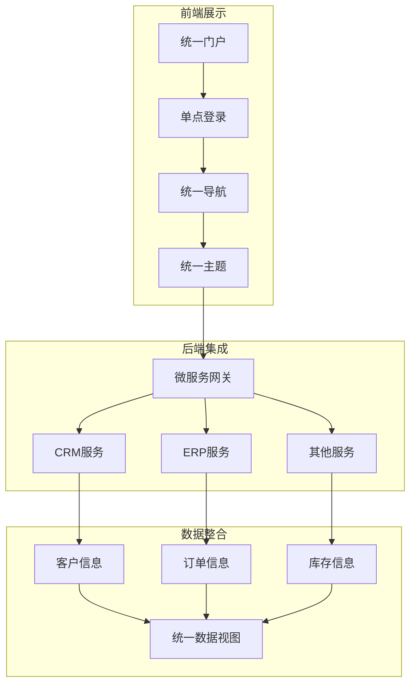
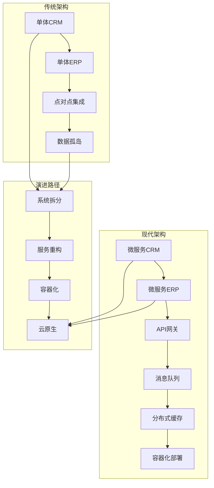
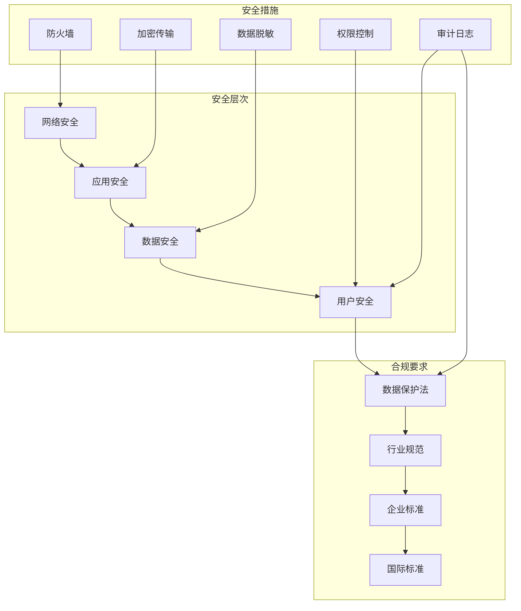

# ERP&CRM学习 - Step 3

## ERP与CRM的对比分析

### 1. 关注焦点不同

**ERP (企业资源计划)**
- **内部导向**：关注企业内部资源优化
- **效率驱动**：提高运营效率，降低成本
- **流程标准化**：规范企业内部业务流程
- **资源管理**：人、财、物、信息等资源管理

**CRM (客户关系管理)**
- **外部导向**：关注客户关系和体验
- **收入驱动**：增加销售收入，提升客户满意度
- **个性化服务**：满足不同客户的个性化需求
- **关系管理**：客户全生命周期的关系维护

### 2. 管理范围对比

## 常见混淆误区

### 误区1：功能重叠就是重复建设

**实际情况**：
- ERP侧重内部执行，CRM侧重外部关系
- 两者在客户、订单、产品等数据上有交集，但处理角度不同
- 正确的做法是数据集成，而非功能取舍

### 误区2：先实施ERP还是CRM是二选一

**实际情况**：
- 根据企业痛点选择优先级
- 制造型企业通常先ERP，服务型企业通常先CRM
- 最终目标是两者集成，形成完整管理体系

### 误区3：数据集成就是简单的数据同步

**实际情况**：
- 需要考虑数据一致性、实时性、安全性
- 涉及复杂的业务逻辑映射
- 需要建立主数据管理机制

## 实际生产中的关系模式

### 1. 协同关系

### 2. 并行关系

### 3. 集成架构模式

## 开发者面临的挑战和场景

### 1. 数据集成挑战

#### 主数据管理

**挑战场景**：
- 同一客户在不同系统中信息不一致
- 数据格式和编码标准不统一
- 实时同步与性能之间的平衡

### 2. 业务流程集成挑战

#### 跨系统业务流程

**挑战场景**：
- 分布式事务的一致性保证
- 系统间调用的性能和可靠性
- 错误处理和异常恢复机制

### 3. 用户体验一致性挑战

#### 统一用户界面

**挑战场景**：
- 不同系统UI风格和交互逻辑统一
- 用户权限和角色管理
- 响应速度和用户体验优化

### 4. 技术架构挑战

#### 系统架构演进

**挑战场景**：
- 遗留系统与现代架构的融合
- 技术栈升级和数据迁移
- 性能扩展和负载均衡

### 5. 安全和合规挑战

#### 安全架构

**挑战场景**：
- 跨系统数据传输的加密和认证
- 不同国家和地区的数据合规要求
- 审计日志和追踪机制

## 开发者技能要求

### 1. 技术技能
- **集成技术**：ESB、API网关、消息队列
- **数据库**：关系型数据库、NoSQL、数据同步
- **架构设计**：微服务、分布式系统、云原生
- **安全**：身份认证、数据加密、权限控制

### 2. 业务理解
- **业务流程**：销售、采购、生产、财务等
- **行业知识**：制造业、服务业、零售业等
- **管理理念**：ERP管理思想、CRM客户理念

### 3. 项目管理
- **需求分析**：业务需求转化为技术方案
- **测试策略**：集成测试、性能测试、安全测试
- **部署运维**：持续集成、监控告警、故障恢复

## 最佳实践建议

1. **循序渐进**：从简单集成开始，逐步深入
2. **标准化**：建立统一的数据标准和接口规范
3. **监控体系**：建立完整的监控和告警机制
4. **团队协作**：业务人员和技术人员紧密配合
5. **持续优化**：基于实际使用情况持续改进

这些挑战和解决方案将帮助开发者更好地理解和应对ERP与CRM系统集成中的复杂问题。
