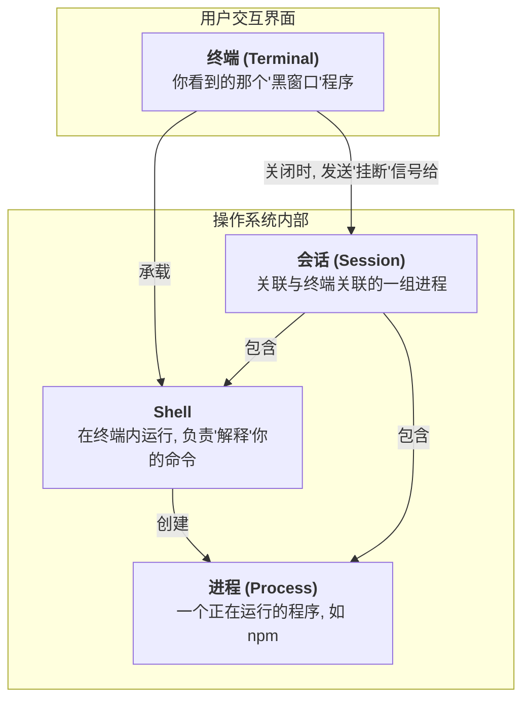
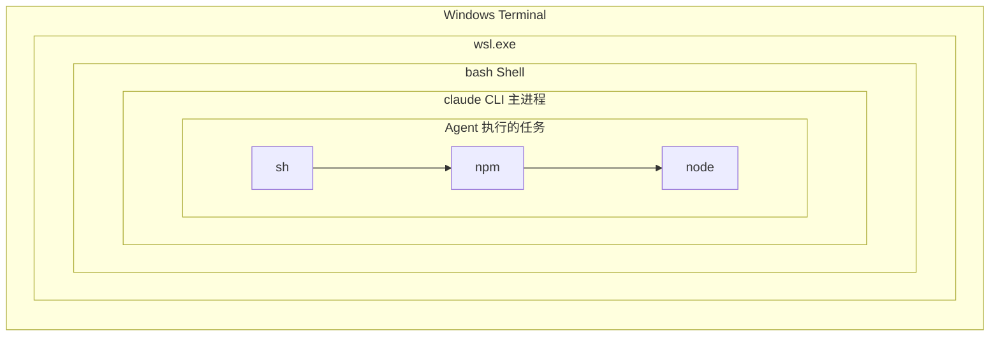
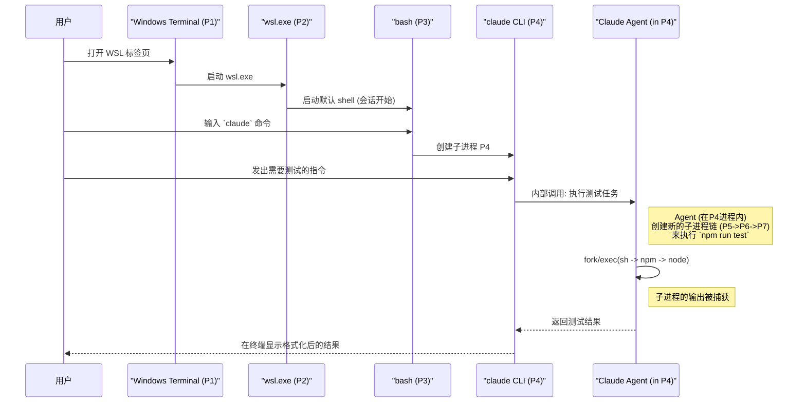
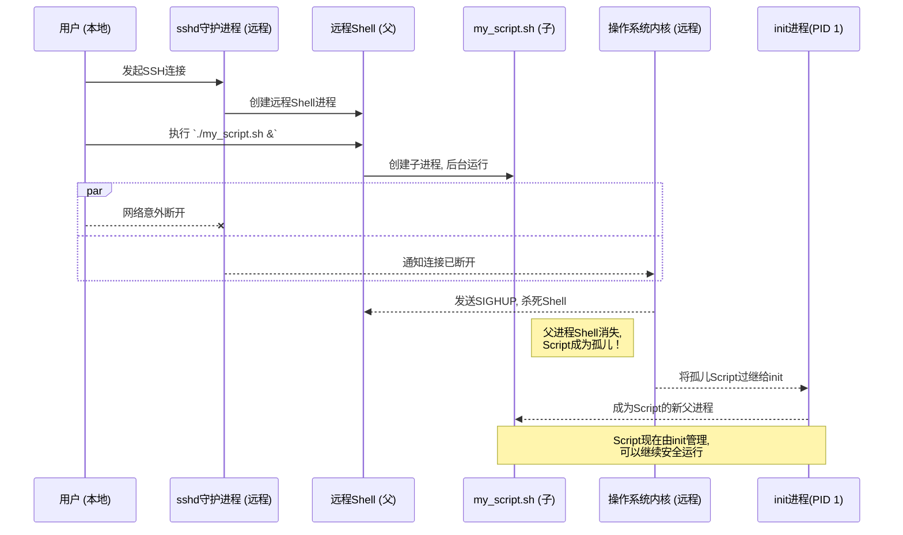

# 为什么CI能让服务持续运行，而我的终端一关服务就停？

曾经有过这样的困惑：在 `git bash` 中运行 `npm run start` 启动一个 Next.js 服务，一切正常；   
但当你关闭 `git bash` 窗口时，这个服务也随之关闭了。   
但是，在 CI/CD 中（如 GitHub Actions,Gitlab Runner），脚本启动的 `nginx` 或 `next` 服务却能在脚本结束后持续运行。

要回答这个问题，需要理解几个基础概念：终端、Shell、进程、会话。

## 核心概念：它们到底是什么关系？

让我们一图流厘清这些容易混淆的术概念。



1.  **终端 (Terminal)**：就是我们看到的那个程序窗口，如 `git bash`、`Windows Terminal`。它负责显示文字、接收你的键盘输入。它是一个“壳子”。
    *   **深入一点**：现代终端本质上都是 **伪终端 (Pseudo-terminal, PTY)** 的模拟器。在早期，终端是笨重的物理硬件。现在，操作系统内核提供了一个名为 PTY 的软件接口，它像一根管道，一端连接着终端模拟器程序（如 Windows Terminal），另一端连接着 Shell。

2.  **Shell**：运行在终端“壳子”里的程序，比如 `bash`、`PowerShell` 或 `zsh`。它负责理解你输入的命令（如 `npm run start`），并告诉操作系统如何去执行。
    *   **澄清误区**：曾经我以为 `PowerShell` 和 `Windows Terminal` 是同级的东西，其实不是。
      `Windows Terminal` 是终端程序（壳子），而 `PowerShell` 是它默认承载的 Shell（命令解释器）。可以修改配置让 `Windows Terminal` 启动 `cmd.exe` 或者 `bash` 作为默认 Shell。

3.  **进程 (Process)**：一个正在运行的程序实例。`npm run start` 会启动一个 `node` 进程。Shell 本身也是一个进程。

4.  **会话 (Session)**：当打开一个终端窗口时，操作系统会创建一个**会话**。这个会话就像一个“篮子”，装入了当前 Shell 进程以及由它启动的所有子进程（比如那个 `node` 服务）。这个“篮子”是和终端窗口绑定的。
    *   **内核如何管理**：在操作系统内核层面，它通过 **进程ID (PID)** 和 **会话ID (SID)** 来维系这个关系。会话中的所有进程都共享同一个 SID。当与这个会话关联的伪终端 (PTY) 关闭时，内核就知道要向所有持有该特定 SID 的进程发送 `SIGHUP` 信号。

5.  **进程组 (Process Group)**：这是一个介于“会话”和“进程”之间的概念，可以理解为会话这个“大篮子”里的小分类“提篮”，主要用于 Shell 的**作业控制 (Job Control)**。
    *   **举个例子**：当你执行 `ls -l | grep ".py"` (列出当前目录下的所有文件和子目录的详细信息，然后筛选出文件名中包含 ".py" 的行。) 时，Shell 会创建一个新的**进程组**，并将 `ls` 和 `grep` 这两个进程都放进去。这个进程组有自己唯一的 ID (PGID)，通常是管道中第一个进程的 PID。
    *   **这有啥用？**：这可以让操作系统对这一组进程进行统一操作。比如，当你按下 `Ctrl+C` 时，`SIGINT`（中断）信号会发送给当前**前台进程组**中的所有进程，从而干净利落地终止整个管道，而不是只终止一个 `grep`。
    *   **层级关系**：所以，更完整的关系是：**会话 (Session) > 进程组 (Process Group) > 进程 (Process)**。

6.  **SIGHUP 信号 (挂断信号)**：这是解释本文开题的关键。在现代系统中，**当闭终端窗口时，操作系统会向与该窗口绑定的整个会话发送一个 `SIGHUP`（挂断）信号**。收到这个信号的进程，默认行为就是**终止运行**。

7.  **守护进程 (Daemon)**：这是服务能持续运行的**直接原因**。
    *   **它是什么？**：守护进程是一个在后台运行，且**已完全脱离任何控制终端**的进程。因为它不属于任何一个与终端绑定的“篮子”，所以即使用户注销或关闭所有终端窗口，它也**不会收到 `SIGHUP` 信号**，从而可以持续运行。
    *   **如何实现？**
        *   **简单方式**：使用 `nohup` (no hang up) 命令，它可以让进程忽略 `SIGHUP` 信号。例如：`nohup npm run start &` ( `&` 符号让命令在后台运行)。
        *   **标准方式**：将应用注册为系统服务（如使用 Linux 的 `systemd` 或 `service`），由操作系统直接在启动时管理，它们天生就是守护进程。CI/CD 环境通常会采用这种或类似的方式来启动需要持久运行的服务。
        *   **一个特例：Docker 容器**：你可能在 `Dockerfile` 中看到 `CMD ["nginx", "-g", "daemon off;"]`。为什么需要持续运行的服务是daemon off?**为什么？** 因为 Docker 容器的生命周期完全依赖其主进程（PID 1）。如果 Nginx 按默认方式“守护进程化”自己，主进程会启动 worker 子进程后就退出，这会导致 Docker 认为任务已完成并立即关闭容器。`daemon off;` 指令强制 Nginx 在**前台**运行，使其主进程持续存在，从而让容器保持存活。   
     在 Docker 的世界里，容器本身就是“守护进程”，所以容器里面的应用必须在前台运行。

## 进程的特殊状态：孤儿与僵尸

在进入具体场景前，我们还需要了解两种特殊的进程状态，这对于理解后台任务和进程风险至关重要。

*   **孤儿进程 (Orphan Process)**：当一个父进程比它的子进程先一步退出时，这个子进程就成了“孤儿”。操作系统不会让它无人问津，而是会立即让系统的根进程 `init` (PID 1) 来**收养**它，并负责在其结束后回收资源。

*   **僵尸进程 (Zombie Process)**：一个子进程已经结束运行，但其父进程没有来得及回收它的退出信息（如退出状态码），导致它在进程表里留下一个“尸体”记录。这个“尸体”就是僵尸进程。

## 场景分析

### 场景一：解答开篇的疑问 (本地 vs CI/CD)

理解了上面的概念，最初的疑问就迎刃而解了。

*   **本地运行**：你启动 `npm run start`，`node` 进程属于你当前终端的会话。关闭终端，整个会话收到 `SIGHUP` 信号，`node` 进程按默认行为终止。
*   **CI/CD 运行**：CI/CD 系统启动 `nginx` 或 `next` 服务时，会运用我们上面提到的“守护进程”技术（如 `systemd` 或类似的机制），让服务进程脱离当前脚本的会话，成为一个独立的守护进程。因此，即使 CI/CD 的脚本执行完毕，服务进程也不会收到 `SIGHUP` 信号，从而能够持续运行。

### 场景二：`claude code` 的进程“套娃”

现在，让我们用一个更复杂的例子，看看命令行 AI Agent `claude code` 是如何工作的，来串联所有知识。

当你在 WSL 中启动 `claude`并下达命令: `重构我的代码并运行测试` 时，发生了什么？



这个视图则侧重于时间线，展示了从用户操作开始，各个进程之间是如何依次被创建和调用的，以及它们之间的通信流程（例如，`claude` 如何捕获 `npm` 的输出并返回给用户）。



这不是“终端里开终端”，而是一条清晰的**进程创建链**：

1.  `Windows Terminal` (P1) 启动 `wsl.exe` (P2)。
2.  `wsl.exe` (P2) 启动 `bash` (P3)，这是你的**会话**领导者。
3.  `bash` (P3) 接收你的命令，创建 `claude` (P4) 子进程。
4.  `claude` (P4) 进程为了执行测试，会创建自己的子进程链：`sh` (P5) -> `npm` (P6) -> `node` (P7)。
5.  **关键在于**：P5、P6、P7 的所有输出（标准输出/错误）都被它们的父进程 P4 **捕获和重定向**了。P4 拿到测试结果后，再格式化输出到它自己的标准输出上，最终显示在你的 `Windows Terminal` 窗口里。

整个过程只有一个终端、一个会话，但里面上演了一出由父子进程构成的“俄罗斯套娃”大戏。

### 场景三：SSH远程登录与孤儿进程

SSH 登录是前面提到的**孤儿进程**的经典应用。

*   **SSH 登录时发生了什么？** 当你从本地通过 `ssh user@MachineB` 登录到远程服务器时，`sshd` 守护进程会在服务器上为你创建一个全新的、独立的会话。你的本地终端只是在“遥控”这个远程会话。
*   **如何利用孤儿进程机制？** 想象一下，你在 SSH 登录后，在远程服务器上启动了一个需要长时间运行的脚本，并让它在后台运行：`./my_long_script.sh &`。然后，你的本地网络突然断开，或者你不小心关闭了本地终端。
    1.  本地的 `ssh` 客户端退出。
    2.  远程服务器检测到连接中断，会杀死你这次登录的 Shell 进程（即 `my_long_script.sh` 的父进程）。
    3.  此时，`my_long_script.sh` 就成了一个**孤儿进程**！
    4.  操作系统内核介入，将它过继给 `init` 进程。
    5.  因为它的新父亲 `init` 永远不会死，所以 `my_long_script.sh` 就脱离了原来会话的控制，即使你已断开连接，它依然能继续在后台运行。

这解释了为什么有时候 SSH 断开后，一些后台任务还能继续执行——正是孤儿进程的“被收养”机制在起作用。



### 场景四：僵尸进程的风险 (PID耗尽攻击)

前面定义的**僵尸进程**则代表了一种真实的风险。

*   **风险何在？** 想象一个编程糟糕的网络服务器，它为每个新连接都创建一个子进程来处理，但从不回收处理完毕的子进程。
    1.  攻击者可以编写脚本，在瞬间向上万次地连接这个服务器。
    2.  每一次连接都会产生一个服务子进程，然后很快变成一个僵尸进程。
    3.  操作系统的进程ID（PID）数量是有上限的（比如32768）。海量的僵尸进程会迅速填满这个进程表。
    4.  一旦耗尽，系统将无法创建任何新的进程——管理员甚至无法通过 SSH 登录来修复问题，因为连创建登录会话的进程都无法启动了。整个系统因此陷入瘫痪。

这个例子说明，妥善处理子进程的“身后事”，是健壮的服务器编程中一个至关重要的环节。

---

## 最后的思考：AI CLI 比 IDE AI Chat 好在哪？

核心区别在于**组合性**和**自动化**。

### 1. 组合性：Unix 哲学

命令行 Agent 就像一个新"积木"，可以与其他工具（`grep`, `sed`, `awk`）无缝组合：
```bash
claude "找出未使用的函数" | xargs claude "安全删除"
```
而编辑器 Agent 是封闭系统，难以与其他工具自动化协作。

### 2. 脚本化：真正的自动化

命令行 Agent 可以写进任何脚本：
*   **Git 钩子**：提交前自动生成测试
*   **CI/CD**：部署时自动更新文档  
*   **定时任务**：每日自动扫描依赖安全

编辑器 Agent 依赖手动操作，无法集成到自动化流程。

### 3. 环境一致性

命令行 Agent 通过 SSH 直接在远程服务器运行，环境完全一致。编辑器 Agent 本体在本地，通过"代理"操作远程文件，复杂且不可靠。

### 总结

*   **命令行 AI Agent**：**超级管家** — 给任务清单，自动完成，可重复执行
*   **编辑器 AI Agent**：**贴身助理** — 即时帮助，上下文理解强

对于自动化和工具链集成场景，命令行 Agent 确实更强大。
