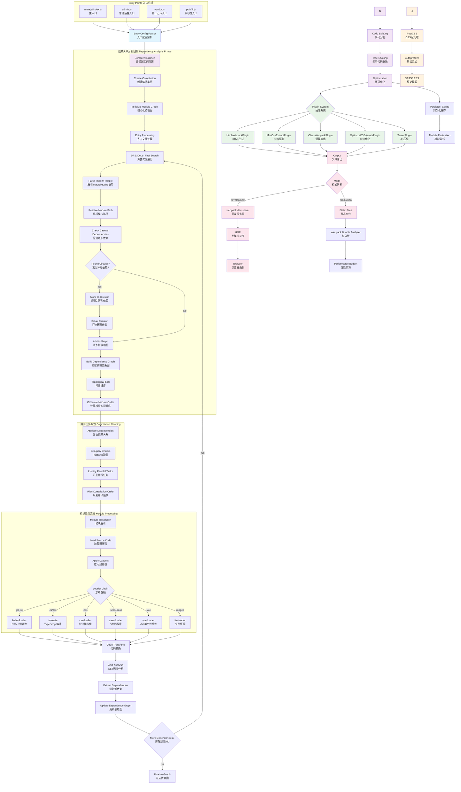

```mermaid
graph TB
    %% 多入口点处理
    subgraph "Entry Points 入口分析"
        A1[main.js/index.js<br/>主入口]
        A2[admin.js<br/>管理后台入口]
        A3[vendor.js<br/>第三方库入口]
        A4[polyfill.js<br/>兼容性入口]
    end
    
    %% 配置解析
    A1 --> B[Entry Config Parser<br/>入口配置解析]
    A2 --> B
    A3 --> B
    A4 --> B
    
    B --> C[Compiler Instance<br/>编译器实例创建]
    
    %% 依赖关系分析阶段 - 核心重点
    subgraph "依赖关系分析阶段 Dependency Analysis Phase"
        C --> D1[Create Compilation<br/>创建编译实例]
        
        D1 --> D2[Initialize Module Graph<br/>初始化模块图]
        D2 --> D3[Entry Processing<br/>入口文件处理]
        
        %% 深度优先搜索
        D3 --> E1[DFS: Depth First Search<br/>深度优先遍历]
        E1 --> E2[Parse Import/Require<br/>解析import/require语句]
        E2 --> E3[Resolve Module Path<br/>解析模块路径]
        E3 --> E4[Check Circular Dependencies<br/>检测环形依赖]
        
        %% 环形依赖处理
        E4 --> F1{Found Circular?<br/>发现环形依赖?}
        F1 --> |Yes| F2[Mark as Circular<br/>标记为环形依赖]
        F1 --> |No| F3[Add to Graph<br/>添加到依赖图]
        F2 --> F4[Break Circular<br/>打破环形依赖]
        F4 --> F3
        
        %% 依赖图构建
        F3 --> G1[Build Dependency Graph<br/>构建依赖关系图]
        G1 --> G2[Topological Sort<br/>拓扑排序]
        G2 --> G3[Calculate Module Order<br/>计算模块加载顺序]
    end
    
    %% 编译任务规划
    subgraph "编译任务规划 Compilation Planning"
        G3 --> H1[Analyze Dependencies<br/>分析依赖关系]
        H1 --> H2[Group by Chunks<br/>按chunk分组]
        H2 --> H3[Identify Parallel Tasks<br/>识别并行任务]
        H3 --> H4[Plan Compilation Order<br/>规划编译顺序]
    end
    
    %% 模块处理流程
    subgraph "模块处理流程 Module Processing"
        H4 --> I1[Module Resolution<br/>模块解析]
        I1 --> I2[Load Source Code<br/>加载源代码]
        I2 --> I3[Apply Loaders<br/>应用加载器]
        
        %% Loader链处理
        I3 --> J1{Loader Chain<br/>加载器链}
        J1 --> |.js/.jsx| J2[babel-loader<br/>ES6/JSX转换]
        J1 --> |.ts/.tsx| J3[ts-loader<br/>TypeScript编译]
        J1 --> |.css| J4[css-loader<br/>CSS模块化]
        J1 --> |.scss/.sass| J5[sass-loader<br/>SASS编译]
        J1 --> |.vue| J6[vue-loader<br/>Vue单文件组件]
        J1 --> |images| J7[file-loader<br/>文件处理]
    end
    
    %% 代码转换和优化
    J2 --> K1[Code Transform<br/>代码转换]
    J3 --> K1
    J4 --> K1
    J5 --> K1
    J6 --> K1
    J7 --> K1
    
    K1 --> K2[AST Analysis<br/>AST语法分析]
    K2 --> K3[Extract Dependencies<br/>提取新依赖]
    K3 --> K4[Update Dependency Graph<br/>更新依赖图]
    
    %% 循环检测
    K4 --> L1{More Dependencies?<br/>还有新依赖?}
    L1 --> |Yes| E1
    L1 --> |No| L2[Finalize Graph<br/>完成依赖图]
    
    %% 代码分割和优化
    N --> O[Code Splitting<br/>代码分割]
    O --> P[Tree Shaking<br/>无用代码消除]
    P --> Q[Optimization<br/>代码优化]
    
    %% 插件系统
    Q --> R{Plugin System<br/>插件系统}
    R --> S[HtmlWebpackPlugin<br/>HTML生成]
    R --> T[MiniCssExtractPlugin<br/>CSS提取]
    R --> U[CleanWebpackPlugin<br/>清理输出]
    R --> V[OptimizeCSSAssetsPlugin<br/>CSS优化]
    R --> W[TerserPlugin<br/>JS压缩]
    
    %% 输出
    S --> X[Output<br/>文件输出]
    T --> X
    U --> X
    V --> X
    W --> X
    
    %% 开发服务器
    X --> Y{Mode<br/>模式判断}
    Y --> |development| Z[webpack-dev-server<br/>开发服务器]
    Y --> |production| AA[Static Files<br/>静态文件]
    
    %% HMR热更新
    Z --> AB[HMR<br/>热模块替换]
    AB --> AC[Browser<br/>浏览器更新]
    
    %% 样式处理
    J --> AD[PostCSS<br/>CSS后处理]
    AD --> AE[Autoprefixer<br/>前缀添加]
    AE --> AF[SASS/LESS<br/>预处理器]
    
    %% 现代特性
    AA --> AG[Webpack Bundle Analyzer<br/>包分析]
    AG --> AH[Performance Budget<br/>性能预算]
    
    %% 缓存优化
    Q --> AI[Persistent Cache<br/>持久化缓存]
    AI --> AJ[Module Federation<br/>模块联邦]
    
    classDef entry fill:#e1f5fe
    classDef core fill:#f3e5f5
    classDef loader fill:#fff3e0
    classDef plugin fill:#e8f5e8
    classDef output fill:#fce4ec
    
    class A,B entry
    class C,D,E,F,G,N,O,P,Q core
    class H,I,J,K,L,M,AD,AE,AF loader
    class R,S,T,U,V,W plugin
    class X,Y,Z,AA,AB,AC output
```
