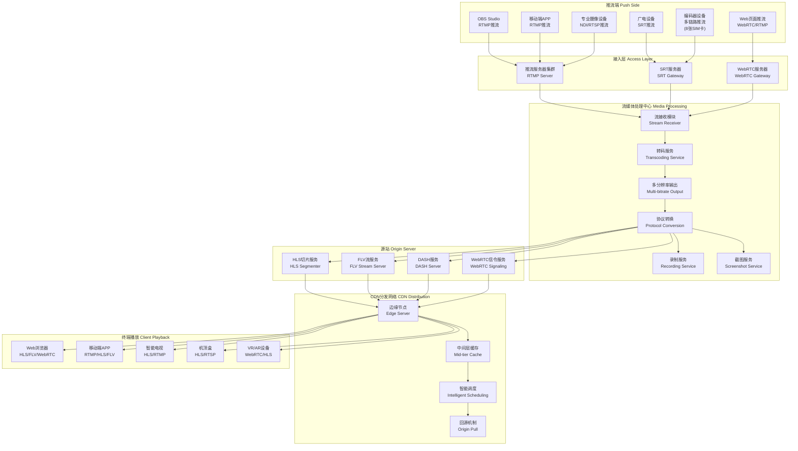

# 流媒体业务完整流程解析

从直播推流到公网分发播放的完整技术链路，涵盖推流、处理、分发、播放全流程。

## 流程概览图



## 1. 推流端 (Push Side)

### 1.1 主要推流方式

#### RTMP推流
- **OBS Studio**: 最常用的开源推流软件
  - 支持多种编码格式 (H.264, H.265, AV1)
  - 可配置码率、分辨率、帧率
  - 支持场景切换、音频混音
  - 推流地址格式: `rtmp://server:port/app/streamkey`

- **移动端APP推流**:
  - iOS: 使用 ReplayKit、AVFoundation
  - Android: 使用 MediaRecorder、Camera2 API
  - 集成第三方SDK: 金山云、七牛云、腾讯云等

#### Web页面推流
- **WebRTC推流**:
  - 获取摄像头权限: `navigator.mediaDevices.getUserMedia()`
  - 实时音视频传输，延迟极低 (<1秒)
  - 支持P2P连接，减少服务器负载
  - 需要STUN/TURN服务器进行NAT穿透

- **WebRTC to RTMP转换**:
  - 浏览器采集 -> WebRTC -> 服务器转RTMP
  - 兼容现有RTMP基础设施

#### 专业设备推流

##### SRT推流 (Secure Reliable Transport)
- **广电级设备**:
  - 支持前向纠错 (FEC)
  - 自适应码率调整
  - 网络抖动补偿
  - 加密传输保障

- **多链路推流**:
  - 编码器插入8张SIM卡
  - 多运营商网络聚合
  - 链路冗余和负载均衡
  - 断网自动切换

##### NDI/RTSP推流
- **NDI (Network Device Interface)**:
  - 局域网内设备互联
  - 低延迟、高质量传输
  - 支持4K/8K高分辨率

- **RTSP推流**:
  - IP摄像头标准协议
  - 支持组播和单播
  - 可配置传输参数

## 2. 接入层 (Access Layer)

### 2.1 推流服务器集群
- **RTMP Server**:
  - 基于Nginx-RTMP模块或SRS
  - 支持集群负载均衡
  - 推流认证和鉴权
  - 连接数监控和限制

- **SRT Gateway**:
  - SRT协议终结点
  - 转换为内部流媒体格式
  - 网络质量监控

- **WebRTC Gateway**:
  - WebRTC信令处理
  - ICE候选者收集
  - 媒体流中继

### 2.2 接入层功能
- **推流认证**: 流密钥验证、IP白名单
- **连接管理**: 连接池、超时处理
- **监控告警**: 推流状态、网络质量监控

## 3. 流媒体处理中心 (Media Processing)

### 3.1 核心处理流程

#### 流接收模块
- **多协议支持**: RTMP、SRT、WebRTC、RTSP
- **流解析**: 提取音视频流信息
- **格式检测**: 编码格式、分辨率、码率检测

#### 转码服务 (Transcoding)
- **编码器选择**:
  - 软编码: FFmpeg、x264、x265
  - 硬编码: NVIDIA NVENC、Intel Quick Sync、AMD VCE
  - 云端GPU加速: AWS Elemental、Azure Media Services

- **编码参数**:
  - **视频编码**: H.264 (AVC), H.265 (HEVC), AV1, VP9
  - **音频编码**: AAC, MP3, Opus, AC-3
  - **码率控制**: CBR, VBR, CRF模式

#### 多分辨率输出 (ABR - Adaptive Bitrate)
```
原始流 (1080p 4Mbps)
├── 1080p - 4000kbps (高清)
├── 720p  - 2500kbps (标清)
├── 480p  - 1200kbps (流畅)
├── 360p  - 800kbps  (省流)
└── 240p  - 400kbps  (极速)
```

#### 协议转换
- **输入格式**: RTMP FLV容器
- **输出格式**:
  - HLS (HTTP Live Streaming): `.m3u8` + `.ts`文件
  - FLV: Flash Video格式，HTTP-FLV流
  - DASH: Dynamic Adaptive Streaming
  - WebRTC: 实时通信协议

### 3.2 附加服务

#### 录制服务
- **录制格式**: MP4, FLV, HLS
- **录制策略**: 
  - 实时录制: 边推边录
  - 定时录制: 按时间段分割
  - 事件录制: 基于触发条件

#### 截图服务
- **截图时机**: 定时截图、关键帧截图
- **图片格式**: JPEG, PNG, WebP
- **应用场景**: 封面图、审核、监控

## 4. 源站服务 (Origin Server)

### 4.1 HLS服务
- **切片生成**:
  - 切片时长: 通常2-10秒
  - 切片数量: m3u8文件中保持3-6个切片
  - 文件命名: 时间戳或序号命名

- **文件结构**:
```
/hls/streamkey/
├── playlist.m3u8      (主播放列表)
├── 1080p/
│   ├── index.m3u8     (分辨率播放列表)
│   ├── segment_001.ts
│   ├── segment_002.ts
│   └── ...
├── 720p/
│   ├── index.m3u8
│   └── ...
└── 480p/
    ├── index.m3u8
    └── ...
```

### 4.2 FLV流服务
- **HTTP-FLV**: 基于HTTP的FLV流传输
- **特点**: 延迟低 (1-3秒), 兼容性好
- **优势**: 不需要切片，连续流传输

### 4.3 DASH服务
- **国际标准**: ISO/IEC 23009-1
- **支持编码**: AV1, VP9, H.265, H.264
- **自适应**: 客户端根据网络状况选择码率

### 4.4 WebRTC信令服务
- **信令协议**: SDP (Session Description Protocol)
- **传输协议**: WebSocket, HTTP/2
- **功能**: 媒体协商、ICE候选者交换

## 5. CDN分发网络 (Content Delivery Network)

### 5.1 分发架构

#### 边缘节点 (Edge Server)
- **地理分布**: 全球节点部署
- **缓存策略**: 
  - HLS: 缓存.ts文件和.m3u8文件
  - FLV: 实时转发，不缓存
  - DASH: 缓存分片文件
- **负载均衡**: DNS调度、HTTP重定向

#### 中间层缓存 (Mid-tier Cache)
- **分级缓存**: 减少回源压力
- **区域聚合**: 同区域共享缓存
- **热点内容**: 预取和预加载

#### 智能调度
- **调度算法**:
  - 地理位置最近
  - 网络延迟最低
  - 服务器负载最小
  - 成本最优

- **实时监控**:
  - 节点健康状态
  - 带宽使用情况
  - 用户访问质量

### 5.2 回源机制
- **触发条件**: 缓存未命中、内容过期
- **回源策略**: 主备源站、多路回源
- **失败处理**: 自动切换、降级服务

### 5.3 CDN优化技术
- **HTTP/2支持**: 多路复用、服务端推送
- **QUIC协议**: 基于UDP的快速传输
- **边缘计算**: 在边缘节点进行转码和处理

## 6. 终端播放 (Client Playback)

### 6.1 Web浏览器播放

#### HLS播放
- **原生支持**: Safari, Edge (部分)
- **JavaScript库**: 
  - hls.js: 最流行的HLS播放器
  - Video.js: 支持多种格式
  - DPlayer: 弹幕播放器

#### FLV播放
- **flv.js**: 将FLV转换为MP4播放
- **特点**: 低延迟、兼容性好
- **MSE**: Media Source Extensions技术

#### WebRTC播放
- **实时性**: 延迟 <500ms
- **浏览器支持**: Chrome, Firefox, Safari, Edge
- **信令**: WebSocket连接

### 6.2 移动端APP播放

#### iOS播放
- **AVPlayer**: 系统原生播放器
- **支持格式**: HLS, RTMP, FLV, DASH
- **第三方SDK**: 
  - IJKPlayer: 基于FFmpeg
  - PLPlayerKit: 七牛云播放器
  - TXLiteAVSDK: 腾讯云播放器

#### Android播放
- **ExoPlayer**: Google推荐播放器
- **MediaPlayer**: 系统原生播放器
- **支持格式**: 同iOS
- **硬件解码**: MediaCodec API

### 6.3 其他终端设备

#### 智能电视
- **操作系统**: Android TV, Tizen, WebOS
- **支持协议**: HLS, RTMP, RTSP
- **遥控器交互**: 优化的UI界面

#### 机顶盒
- **IPTV标准**: 支持组播和单播
- **编码支持**: H.264, H.265, AVS+
- **CA系统**: 条件接收系统

#### VR/AR设备
- **360度视频**: 全景视频播放
- **空间音频**: 3D音效支持
- **交互功能**: 手势控制、眼动追踪

## 7. 关键技术指标

### 7.1 延迟指标
- **WebRTC**: <500ms (超低延迟)
- **HTTP-FLV**: 1-3秒 (低延迟)
- **HLS**: 6-30秒 (标准延迟)
- **RTMP**: 2-5秒 (低延迟)

### 7.2 质量指标
- **视频质量**:
  - 分辨率: 240p - 4K
  - 帧率: 15fps - 60fps
  - 码率: 400kbps - 8Mbps

- **音频质量**:
  - 采样率: 44.1kHz, 48kHz
  - 码率: 64kbps - 320kbps
  - 声道: 单声道、立体声、环绕声

### 7.3 网络指标
- **带宽适应**: 自适应码率调整
- **网络抖动**: 缓冲区管理
- **丢包处理**: FEC、重传机制

## 8. 业务扩展场景

### 8.1 互动直播
- **连麦功能**: 主播与观众实时互动
- **PK模式**: 多主播同屏竞技
- **弹幕系统**: 实时评论展示

### 8.2 云游戏直播
- **游戏流**: 实时游戏画面传输
- **控制指令**: 观众操作游戏
- **低延迟要求**: <100ms

### 8.3 监控直播
- **多画面**: 同时显示多路监控
- **录像回放**: 历史录像查看
- **报警推送**: 异常事件通知

### 8.4 教育直播
- **屏幕共享**: 课件演示
- **白板功能**: 实时标注
- **互动问答**: 师生互动

## 9. 技术挑战与解决方案

### 9.1 大规模并发
- **问题**: 百万级用户同时观看
- **解决方案**: 
  - CDN分发减轻源站压力
  - 微服务架构水平扩展
  - 数据库分库分表

### 9.2 跨地域传输
- **问题**: 国际网络延迟和丢包
- **解决方案**:
  - 全球CDN节点部署
  - 海底光缆专线
  - 智能路由选择

### 9.3 移动网络适应
- **问题**: 4G/5G网络不稳定
- **解决方案**:
  - 自适应码率调整
  - 网络切换平滑过渡
  - 预测性缓冲

### 9.4 设备兼容性
- **问题**: 不同设备性能差异
- **解决方案**:
  - 多分辨率提供选择
  - 硬件解码优化
  - 降级播放策略

## 10. 监控与运维

### 10.1 监控指标
- **推流监控**:
  - 推流成功率
  - 推流中断次数
  - 网络质量指标

- **播放监控**:
  - 播放成功率
  - 卡顿率
  - 首屏时间

- **系统监控**:
  - 服务器CPU、内存使用率
  - 网络带宽使用情况
  - 存储空间占用

### 10.2 告警机制
- **实时告警**: 服务异常即时通知
- **告警级别**: 紧急、重要、一般
- **通知方式**: 短信、邮件、钉钉、微信

### 10.3 日志分析
- **访问日志**: 用户行为分析
- **错误日志**: 问题定位和修复
- **性能日志**: 系统优化参考

## 结语

流媒体技术是一个复杂的系统工程，涉及音视频编解码、网络传输、分发加速、终端适配等多个技术领域。随着5G、AI、边缘计算等新技术的发展，流媒体业务还将持续演进，为用户提供更优质的音视频体验。

关键成功因素：
1. **技术架构**: 可扩展、高可用的系统设计
2. **用户体验**: 低延迟、高质量的观看体验  
3. **成本控制**: 带宽、存储、计算资源的优化
4. **运维保障**: 7×24小时稳定服务能力

---

## 四、核心技术详解：协议与格式的原理及应用

在了解了直播全链路后，本章将深入探讨不同传输协议、封装格式在具体应用场景下的适用性及背后原理。选择正确的技术组合对于优化用户体验、控制成本以及满足特定业务需求至关重要。

### 1. 关键中间处理环节

在实际业务中，从推流端到拉流端，原始流通常需要经过"转码"和"转协议"这两个核心环节，以保障播放质量和兼容性。

#### 1.1 转码 (Transcoding)

*   **目的**：解决推流端单一码率、分辨率、编码格式无法适配所有观众设备和网络条件的问题。例如，主播推了1080p的高码率流，但部分观众网络较差或设备性能不足。
*   **工作方式**：在流媒体服务器端，将接收到的原始流实时转换为多种不同清晰度（如1080p, 720p, 480p）、不同码率的视频流。这是实现**自适应比特率 (ABR)** 播放的基础。此过程也可能涉及编码格式的转换（如 H.264 转 H.265 以节省带宽，但这会增加服务器计算压力）。
*   **执行位置**：通常在流媒体服务器接收到推流之后，进行分发（如切片、生成播放列表）之前。

> **客户端预处理/多路推流**
>
> 为了降低云端服务器的实时转码压力和成本，一些直播平台会要求或推荐主播使用其定制的推流软件。这类软件可利用主播本地的计算资源，在推流时就直接生成并推送多路不同码率/分辨率的视频流到服务器。这样服务器只需进行简单的转协议和分发，有效降低了云端成本，但对主播的硬件性能提出了更高要求。

#### 1.2 转协议 (Transmuxing / Protocol Conversion)

*   **目的**：解决推流协议（如 RTMP, SRT）不适合直接用于大规模终端用户播放，以及不同播放端对协议兼容性要求不同的问题。
*   **工作方式**：将一种协议封装的音视频数据，转换为另一种协议封装。例如，服务器接收 RTMP 推流后，可以将其转换为 HLS、MPEG-DASH、HTTP-FLV 等协议，再通过 CDN 分发给观众。这个过程通常只改变封装方式，不改变音视频的编码（除非同时进行转码）。
*   **执行位置**：流媒体服务器在接收推流后，根据需要分发给不同协议的客户端时进行。

### 2. 推流协议 (Push Protocols)

推流是指将实时音视频流发送到流媒体服务器的过程。

#### 2.1 RTMP (Real-Time Messaging Protocol)

*   **适用场景**：目前仍是**最主流的直播推流协议**，尤其是在 PC 端使用 OBS 等软件推流的场景。
*   **优势**：
    *   **低延迟**：基于 TCP，通过精心设计的消息机制，可实现 1-3 秒的较低推流延迟。
    *   **广泛支持**：大量的编码器、推流软件和流媒体服务器（如 Nginx-RTMP, SRS）都原生支持。
    *   **稳定可靠**：TCP 保证了数据传输的可靠性。
*   **局限性**：
    *   **播放端兼容性差**：因 Flash 被淘汰，不再适合直接用于现代 Web 端播放。
    *   **不支持新编码**：标准 RTMP 协议原生不支持 H.265(HEVC) 等新一代编码格式。
    *   **端口限制**：其 1935 端口可能被防火墙阻挡，需要依赖 RTMPT/RTMPS 等变种协议。

#### 2.2 SRT (Secure Reliable Transport)

*   **适用场景**：主要用于电视台、大型赛事等**专业广电领域**。硬件导播台、专业编码器等设备原生集成，常用于远距离、跨国等不稳定网络环境下的高质量点对点传输。
*   **优势**：
    *   **低延迟与高可靠**：基于 UDP，但在应用层实现了强大的丢包重传 (ARQ) 和前向纠错 (FEC) 机制，能在保证低延迟的同时，有效对抗网络抖动和丢包。
    *   **安全性**：支持 AES-128/256 加密。
    *   **多链路聚合**：可将多条物理链路（如多张4G/5G SIM卡）虚拟成单一的高速稳定通道，极大提升了户外或移动场景推流的可靠性。
*   **局限性**：
    *   **生态相对较窄**：相比 RTMP，支持的客户端和消费级软件较少，主要集中在专业设备领域。

#### 2.3 WebRTC (Web Real-Time Communication)

*   **适用场景**：**浏览器内直接发起推流**，或需要**极低延迟的互动直播**场景（如直播连麦、视频会议、在线教育等）。
*   **优势**：
    *   **极低延迟**：为实时通信设计，延迟可控制在 1 秒以内，通常低于 500ms。
    *   **浏览器原生支持**：无需任何插件，用户在浏览器即可完成音视频采集和推流。
    *   **强制加密**：通过 DTLS-SRTP 保证传输安全。
*   **局限性**：
    *   **大规模单向分发复杂**：其 SFU/MCU 服务器架构在应对超大规模并发观众时，比传统 CDN 更具挑战性，成本也更高。
    *   **对网络质量敏感**：虽然有拥塞控制机制，但 UDP 传输在极端恶劣网络下表现可能不如 TCP 稳定。

### 3. 分发与播放协议 (Distribution & Playback Protocols)

拉流是指观众从流媒体服务器或 CDN 获取音视频流进行播放的过程。

#### 3.1 HLS (HTTP Live Streaming)

*   **适用场景**：**兼容性要求高、需要大规模 CDN 分发**的场景。是目前 Web 和移动端直播、点播播放的**绝对主流**选择。
*   **优势**：
    *   **极佳的兼容性**：iOS/macOS 原生支持，Android 和主流浏览器通过 JavaScript 播放器（如 `hls.js`）也能良好支持。
    *   **CDN 极致友好**：基于 HTTP 标准文件格式 (`.m3u8`, `.ts`)，与 CDN 架构完美契合，分发效率高，成本相对较低。
    *   **天然支持 ABR**：客户端可根据网络状况在不同码率的流之间平滑切换。
*   **局限性**：
    *   **原生延迟较高**：传统的 HLS 基于文件切片和播放列表更新机制，通常导致 6-30 秒的延迟。
*   **发展**：**低延迟HLS (LL-HLS)** 通过缩短切片时长、分块传输编码 (CTE)、播放列表增量更新等技术，可将延迟降低到 2-5 秒，甚至更低，使其竞争力大增。

#### 3.2 MPEG-DASH (Dynamic Adaptive Streaming over HTTP)

*   **适用场景**：与 HLS 类似，适用于需要大规模 CDN 分发和 ABR 的场景，尤其是在**非苹果生态**或需要**更灵活编解码器/DRM选择**的场合。
*   **优势**：
    *   **国际标准，开放灵活**：编解码器中立，支持更广泛的音视频编码 (VP9, AV1) 和 DRM 方案。
    *   **低延迟**：通过 **CMAF (Common Media Application Format)** 和分块传输等技术，DASH 也能实现较低延迟。CMAF 旨在统一 HLS 和 DASH 的媒体片段格式，进一步提高分发效率。
*   **局限性**：
    *   **iOS 原生支持有限**：虽可通过 `dash.js` 等播放器支持，但原生支持不如 HLS，生态相对稍弱。

#### 3.3 HTTP-FLV (FLV over HTTP)

*   **适用场景**：对延迟有较高要求的 **PC Web 端直播播放**，在国内广泛应用。
*   **优势**：
    *   **延迟低**：通过 HTTP 长连接模拟流式传输，延迟可以做到与 RTMP 相当（1-3 秒）。
    *   **HTTP 友好**：基于 HTTP，易于穿透防火墙，可复用现有 CDN 基础设施。
*   **局限性**：
    *   **移动端支持不佳**：在移动端浏览器上需要依赖 JavaScript (`flv.js`) 解封装，性能开销较大，不如 HLS 普及。
    *   **非标准协议**：相较于 HLS/DASH，并非官方标准。

#### 3.4 WebRTC (用于播放)

*   **适用场景**：需要**亚秒级延迟**的场景，如**视频会议、在线教育、直播连麦、云游戏、远程控制**等。
*   **优势**：
    *   **极致的实时性**：专为实时双向通信设计，延迟最低。
    *   **P2P 能力**：在合适网络条件下可实现端到端通信，减轻服务器压力。
*   **挑战**：
    *   **公有云大规模应用**：尽管挑战巨大，但领先的云厂商已利用其全球分布式媒体节点和智能路由技术，构建了大规模、超低延迟的直播服务（如"快直播"），但单位带宽成本通常高于传统 HLS/HTTP-FLV 直播。

### 4. 业务场景下的技术选型总结

选择合适的协议和格式是一个权衡的过程，为了更清晰地展示技术选型，我们以"协议为核心"的视角来归纳其主要适用场景。

#### **RTMP (推流)**
*   **核心场景**: **通用直播推流**（秀场、电商、游戏、教育录播等）。
*   **选型理由**: 生态极为成熟，绝大部分推流软件（如OBS）和流媒体服务器都原生支持，稳定可靠，是目前推流方案的"最大公约数"。

#### **SRT (推流)**
*   **核心场景**: **专业广电制播、跨国远距离传输、户外等不稳定网络环境**下的高质量推流。
*   **选型理由**: 具备强大的抗丢包和前向纠错能力，结合多链路聚合技术，能在恶劣网络下提供远超RTMP的稳定性和可靠性。

#### **HLS (分发/播放)**
*   **核心场景**: **几乎所有需要大规模分发的直播和点播场景**，尤其是在移动端（iOS/Android）。
*   **选型理由**: 兼容性王者，能覆盖所有主流平台；与CDN架构完美契合，分发成本效益高；天然支持ABR（自适应码率）。是分发/播放侧的"事实标准"。
*   **演进方向**: 采用 **LL-HLS**（低延迟HLS），可将延迟降至2-5秒，适用于对延迟有一定要求的准低延迟直播场景。

#### **HTTP-FLV (分发/播放)**
*   **核心场景**: **国内PC Web端的低延迟直播**。
*   **选型理由**: 能实现1-3秒的较低延迟，且基于HTTP，对CDN友好，技术方案成熟。在追求PC端低延迟体验时是HLS的有力补充。

#### **WebRTC (推流/分发/播放)**
*   **核心场景**: **所有需要亚秒级延迟的实时互动场景**。
    *   **互动直播**: 如视频会议、在线教育小班课、直播连麦PK。
    *   **创新应用**: 如云游戏、远程控制、视频客服。
*   **选型理由**: 延迟最低（<1s），为实时互动而生，且浏览器原生支持，无需插件。

#### **MPEG-DASH (分发/播放)**
*   **核心场景**: **国际化或需要高级特性的点播和直播**，特别是在非苹果生态中。
*   **选型理由**: 国际标准，编解码器中立（便于使用AV1等新编码），DRM支持更灵活。是HLS的对标和替代方案。

#### **MP4 (点播)**
*   **核心场景**: **短视频点播**。
*   **选型理由**: 格式简单，兼容性极好，单个文件易于管理和分发，无需复杂服务器配置，非常适合时长较短的视频。

#### **RTSP (接入)**
*   **核心场景**: **安防监控设备**（IPC/NVR）的视频流接入。
*   **选型理由**: 传统安防行业的标准协议。通常在服务器侧接收RTSP流后，会将其转换为更适合公网播放的协议（如HLS, HTTP-FLV, WebRTC）。

理解每种技术的优劣和适用边界，是构建稳定、高效、体验优秀的流媒体系统的关键。

